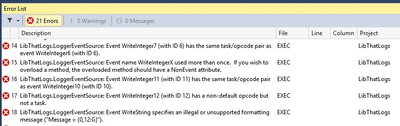

# EventRegister User’s Guide

EventRegister refers to the NuGet package that integrates with your projects to
provide

1. build time validation and
2. registration support for your event source classes.

## User’s Guide

The `Microsoft.Diagnostics.Tracing.EventRegister` NuGet package was designed to
enable EventSource validation and registration support, whether your event
source classes derive from the system `EventSource`
(`System.Diagnostics.Tracing.EventSource` – `SDT.EventSource` from here on) or
from the `EventSource` type shipping in the `EventSource` NuGet package
(`Microsoft.Diagnostics.Tracing.EventSource` aka `MDT.EventSource`). The package
contains a command-line tool (`eventRegister.exe`), a targets file that is
injected in the referencing project (and calls the command line tool with
appropriate options), and this user guide.

Most common uses of this package will just work as soon as the NuGet reference
is added to your projects. A rebuild of your project will:

* ensure that all classes deriving from a supported `EventSource` base class are
  validated, and 
* ensure registration artifacts (a DLL and a MAN file) will be generated in the
  project’s output directory for every `EventSource` class that needs explicit
  registration (currently only classes that use ETW channel support).

## Event Source Validation

After the `EventRegister` NuGet is added to your project a rebuild will produce
output similar to

The `eventRegister` command line tool runs on the assembly produced by your
project and does not provide line information for the errors encountered. The
error messages are as specific as possible in order to enable finding and fixing
the issues as easy as possible. Consequently all messages will specify:

* the project for which the error was encountered (e.g. `LibThatLogs` above), 
* the full type name of the event source type with the error (e.g.
  `LibThatLogs.LoggerEventSource` above), 
* the event name, event number, and/or attribute causing the validation error
  (e.g. event `WriteInteger7`, event ID 6 for error 14 above).

## Event Source Registration

A build of your project also generates a pair of files with the following name
pattern for each qualifying event source class in your project:

1. `<AssemblyName>.<EventSourceTypeName>.etwManifest.man`
2. `<AssemblyName>.<EventSourceTypeName>.etwManifest.dll`

The first file contains the ETW manifest while the second one contains the
binary form of the ETW manifest plus any needed native resources (localization
string tables in particular).

The deployment mechanism for your component (a setup program, most likely) will
need to include these files and to perform one registration step at installation
time and one un-registration step at un-installation time.

Registration:

    wevtutil.exe im <EtwManifestManFile>
        /rf:"<EtwManifestDllFullPathName>"
        /mf:"<EtwManifestDllFullPathName>"

Unregistration:

    wevtutil.exe um <EtwManifestManFile>

EventRegister will (be default) generate ETW manifests that include all
localization information available at the time it runs. This is needed because
the manifest is generated at build time, when there’s no information regarding
the culture in which the final application will run.

## Programmer’s Guide

At its most abstract the `EventRegister` command line tool just a forwarder that
simply calls the `GenerateManifest()` method on an `EventSource` class, passing
in as a first argument the type of (possibly another) event source. And in order
to enable a larger class of uses, `EventRegister` decouples these two types. The
supported combinations enabled by `EventRegister` for a specific event source
type are:

1. Calling `MDT.EventSource.GenerateManifest()` on the event source (whether
   derived from `SDT.EventSource`, or from `MDT.EventSource`), or
2. Calling the `GenerateManifest()` method on the base type for the event source.

The `EventRegister` command line tool refers to the type on which it calls
`GenerateManifest` as the `ManifestGenerator`, and it allows specifying it
using the `-ManifestGenerator` qualifier as either `builtin` (for the first case
above), or as `base` for the second case. When this optional qualifier is not
specified, `builtin` is assumed.

The recommended setting is `builtin`, but if you hit issues with this, please
switch back to `base`.

For event sources derived from `SDT.EventSource` you will notice some
differences when using `builtin` versus `base`:

* Specifying `base` will always generate a manifest (since `SDT.EventSource`
  does not have a notion of static registration, it simply always produces a
  manifest).
* Specifying `builtin` will not produce a manifest (unless the qualifier
  `-ForceAll` is specified on the command line).
* The generated manifests will be slightly different.
* The validation rules applied to the event source will be different (with a
  larger set when using `builtin`).

### Customizing EventRegister for Your Project

If you need to override the defaults used by `EventRegister` you can do so in
your project file by defining these properties somewhere before the
`<Import>` statement that references
`Microsoft.Diagnostics.Tracing.EventRegister.targets`:

#### EtwManifestGenerator
This property allows you to override the default ManifestGenerator used by
`EventRegister`. The property defaults to `builtin` if not specified. You can
override it by specifying `base` in your project file:

    <PropertyGroup>
        ...
        <EtwManifestGenerator>base</EtwManifestGenerator>
        ...
    </PropertyGroup>

#### EtwManifestForceAll
This property allows you to specify whether to generate manifests for all event
sources in the project, or only for the ones that need static registration. This
property defaults to `false`. Note that validation occurs for all event sources,
whether we generate a manifest for them or not. 

To override this you can define this property in your project file:

    <PropertyGroup>
        ...
        <EtwManifestForceAll>true</EtwManifestForceAll>
        ...
    </PropertyGroup>

#### EtwManifestOutDir and EtwManifestBaseName

These properties give you more control over the location where the manifests are
generated and the base name used when generating these file. You can override
these as in the example below:

    <PropertyGroup>
        ...
        <EtwManifestOutDir>$(OutputPath)ETW\</EtwManifestOutDir>
        <EtwManifestBaseName>OverriddenName</EtwManifestBaseName>
        ...
    </PropertyGroup>

For the example above the manifest files produced would be: 

1. `<ProjectDir>\bin\Debug\ETW\OverriddenName.<MyEventSource>.etwManifest.man`
2. `<ProjectDir>\bin\Debug\ETW\OverriddenName.<MyEventSource>.etwManifest.dll`

### EventRegister Command Line Tool

The `EventRegister` command line tool is the engine responsible for performing
all the above magic. It supports multiple command sets, but `-DumpRegDlls` is
the one that controls all the validation/registration behavior exposed through
the `EventRegister` NuGet package.

#### Command line options
T
he command line options accepted by `EventRegister` have a direct correlation to
the properties described above. The one that may need explanation is
`ManifestXmlPrefix`, which is simply the concatenation of `$(EtwManifestOutDir)`
and `$(EtwManifestBaseName)`.

Here’s the tool’s help for the `DumpRegDlls` command (obtained running 
`eventRegister.exe -? DumpRegDlls`):

    The eventRegister application has a number of commands associated with it,
    each with its own set of parameters and qualifiers.  They are listed below.
    Options that are common to all commands are listed at the end.

    ------------------------------------------------------------------------------------------
    Usage: eventRegister -DumpRegDlls AssemblyPath [ManifestXmlPrefix]

      Just generates the XML manifest and registration DLL for the managed code.

      Parameters:
        AssemblyPath                          The path to the DLL containing the Event provider
                                              (the class that subclasses EventSource).
        [ManifestXmlPrefix]                   The file name prefix used to generate output file
                                              names for the provider manifests.

      Qualifiers:
        [-ForceAll]                           If specified, generate manifests and registration
                                              DLLs for all EventSource-derived classes,
                                              otherwise it generates them only for the classes
                                              that need explicit registration.
    ------------------------------------------------------------------------------------------
    Qualifiers global to all commands:

        [-ReferencePath:STRING]               If specified, use this list of semi-colon
                                              separated assemblies to resolve the assembly
                                              containing the EventSource base class.  Use only
                                              if regular resolution does not work adequately.
        [-ManifestGenerator:STRING(builtin)]  Specifies what code runs to validate and generate
                                              the manifest for the user-defined event source
                                              classes.  Use "builtin" (the default choice) to
                                              choose the tool's builtin EventSource.  Use "base"
                                              to choose the code from the base class of the
                                              user-defined event source.  Or use a path name to
                                              choose the first "EventSource" type from the
                                              assembly specified by the path.

As you may notice there are one or two more options that should not be needed
most of the time, but that give you additional flexibility. I recommend not
using them except when absolutely needed.

## Glossary

For detailed information on Event tracing for Windows [see this page][ETW].

* **ETW provider**: (native concept) a component capable of firing ETW events.
* **ETW manifest**: (native concept) metadata describing an ETW provider and the
  detailed information on the ETW events it might fire.
* **ETW keywords**: (native concept) bit-flags that can be associated with
  events to create event *categories*.
* **ETW tasks**: (native concept) small integers that can be associated with
  events to define *task-oriented* groupings. Generally used in conjunction with
  opcodes.
* **ETW opcodes**: (native concept) small integers that identify an operation
  within a Task. The value of Opcodes is that there are some well-known ones
  like `Start` and `Stop` which allow tools to operate on events in a generic
  way.
* **Event Source**: a user-defined sealed class derived from the `EventSource`
  type.
* **ETW Event Method**: a method defined in an Event Source that fires an ETW
  event. This must be a non-virtual, instance method returning void, that is not
  marked with the `[NonEvent] attribute.
* **ETW Transfer Event Method**: an ETW event method that marks a relation
  between the current activity and a related activity (supported starting with
  v4.5.1 and the NuGet package).

## Resources

* [Event Tracing for Windows][ETW] – Windows based infrastructure for logging
  events in a strongly typed way
* [ETW Manifest Schema][ETW-Schema] – Description of the events particular ETW
  provider can generate.
* [Vance Morrison’s EventSource blog entries][ETW-Vance] – Reference information
  for event sources

[ETW]: http://msdn.microsoft.com/en-us/library/bb968803(VS.85).aspx
[ETW-Schema]: http://msdn.microsoft.com/en-us/library/aa384043(v=VS.85).aspx
[ETW-Vance]: http://blogs.msdn.com/b/vancem/archive/tags/eventsource/