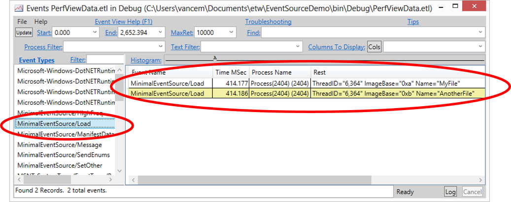

# EventSource User’s Guide

`EventSource` is the central class that allows a developer to create strongly
typed events to be captured by event tracing for Windows (ETW).

## Programmer’s Guide
The purpose of EventSource is to allow a managed-code developer to easily create
a strongly typed specification for logging (possibly high volume) ETW events.
This allows you to write code like this at the site you wish to log an event

    MinimalEventSource.Log.Load(0x40000, "MyFile0");

Notice that the only information that is present is the minimum necessary, namely

1.  The logging object itself (MinimalEventSource.Log)
2.  A method representing the event to log (Load)
3.  Optional parameters which are strongly typed (all Load events always have an
    `int` and `string` values passed to them). 

In particular there are no verbosity levels, event ID, or anything that does not
need to be at the call site. All of that moved to the definition of the
`EventSource`. 

### Defining a Minimal Event Source

One nice attribute of strongly typed eventing is that the call site for logging
an event is ‘minimal’. This is because the user of `EventSource` needs to define
a class that describes all the different kinds of events the user is interested
in generating. Here is an example of such a class. 

    public sealed class MinimalEventSource : EventSource
    {
        public void Load(long baseAddress, string imageName) { WriteEvent(1, baseAddress, imageName);}
        public void Unload(long baseAddress) { WriteEvent(2, baseAddress);}
        public static MinimalEventSource Log = new MinimalEventSource();
    }

The basic structure of these derived classes of `EventSource` is always the
same. In particular:

* The class inherits from `EventSource`. 
* For each different type of event that the user wishes to generate, a method
  needs to be defined. This method should be
    *   Named the name of the event being raised
    *   If the event has additional data, these should be passed as arguments.
        Currently only primitive types, DateTime, and string are allowed to be
        logged with the event. 
* Each method has a body that simply calls `WriteEvent` passing it an ID
  (anumeric value that represents this event), and the arguments of the event
  method. This ID needs to be unique within the `EventSource`. `EventSource`
  allows two mechanisms for assigning these IDs. They are either 
    * The ordinal number of the method in the class (thus the first method in
      the class is 1, second 2 …), or
    * Explicitly assigned using the `Event` attribute for the event method. More
     on this mechanism later.
* EventSources are intended to be singleton instances (one per appdomain is all
  you need). Thus it is convenient to define a static variable (by convention
  called `Log` that represents this singleton. 

### Compiling Your EventSource

To actually compile the simple example above you need only reference the
`EventSource` class itself. This class is part of the .NET Runtime Version 4.5.
It is defined in `mscorlib` (so it is present in the default assembly references
for ANY .NET application), and it lives in the `System.Diagnostics.Tracing`
namespace. 

In addition to the version of `EventSource` built into V4.5 there is an
EventSource NuGet package which is a ‘stand alone’ version of the class. This is
useful if

1. You want to use EventSource on versions of the framework before V4.5 or
2. You want some very new feature of `EventSource` that is not yet present in
   the Framework version

Search for `EventSource` on <http://www.nuget.org/> to find this package.

There is also a very useful ‘EventSource Samples’ Nuget package available. This
gives you working code for a variety of common scenarios. These samples are
well commented to explain why the code is the way it is. To use the samples

1.  Create a new Console application called ‘DemoEventSource’
2.  Reference the ‘EventSource Samples’ package from your application (right
    click on the ‘References’ node of the project and select ‘Managed Nuget
    Packages’ and search for ‘EventSource’). 
3.  Add the call ‘EventSourceSamples.AllSamples.Run()’ to your main program. 

### Enabling your EventSource

Once you have defined an EventSource, you will want to see its events. One way
of doing this is through Event Tracing for Windows (ETW). For example, there is
a tool called PerfView that will let you enable ETW providers, and in particular
EventSources. The command

    PerfView /onlyProviders=*MinimalEventSource run YOUR_APP

Will turn on any `EventSource` called ‘MinimalEventSource’ on the system, and
then run `YOUR_APP`.

    PerfView /onlyProviders=*MinimalEventSource collect

Will do the same and wait until you tell it to stop (thus you can run your
command in another window). In either case it will generate a binary log file
(an .ETL file), that contains the events, and can be viewed in PerfView’s
‘events’ viewer. 

Opening that viewer yields something like the

Notice that the viewer shows you the event name, the (very accurate) time, the
process thread and all the values of the payload. The payload values are
strongly typed (it knows that `ImageBase` is an integer and `Name` is a string,
and no ‘parsing’ is necessary (Because it was never a string blob anywhere in
the event pipeline). If you wish to programmatically manipulate your data, you
should download the `TraceEvent` Nuget package (and in particular the
`TraceEvent Samples` Nuget Package). 

### Recap

So there you have it, a quick end-to-end example of using EventSource. The steps
were:

1. Define a class that inherits from EventSource that defines each event.
2. Call these methods in your code.
3. Use something (in the case above ETW) to turn on your provider and process
   the events. 

## Pick Details

Now that you have the basic outline of what an EventSource is, here we describe
some of the details for using it properly. 

### Rules for defining EventSource Classes

1. Classes that derive from `EventSource` should be sealed. `EventSource` does
   not expect non-trivial hierarchy in the inheritance chain (see exception
   under the “Advanced Customizations” section below).
2. Implementing interfaces on EventSource classes, while not strictly prohibited,
   is certainly not expected usage. 
3. Instance methods in an `EventSource` are **assumed** to log data unless
   otherwise declared (even if they are private). 
    * If you have a need for ‘helper’ instance methods, you must put the
      `[NonEvent]`` attribute on them to declare they are **not** methods that
      log events.
4. Generally the name of the `EventSource` class is a bad ‘public’ name for the
   `EventSource`. Public names (the names that ETW use) has to be globally
   unique in the WORLD. Thus it is good practice to give your EventSource a
   good official name using the `[EventSource]`` attribute.

        [EventSource(Name=”Samples-EventSourceDemos-Minimal”)]
        public sealed class MinimalEventSource : EventSource
        {
            public void Load(long baseAddress, string imageName) { WriteEvent(1, baseAddress, imageName);}
            public void Unload(long baseAddress) { WriteEvent(2, baseAddress);}

            public static MinimalEventSource Log = new MinimalEventSource();
        }

### Rules for defining ETW Event Methods

Here are the most important rules for defining an ETW event method (for more
details see section “ETW Event Method Constraints” below):

1. Any instance, non-virtual, void returning method defined in an event source
   class is by default an ETW event method.
2. Virtual or non-void-returning methods are included, starting with the NuGet
   version of EventSource, only if they are marked with the `[Event]` attribute. 
3. To mark a qualifying method as non-logging you must decorate it with the
   `[NonEvent]` attribute
4. ETW event methods have ETW IDs associated with them either
    1. *Explicitly*: by the developer decorating the method with an `[Event]`
       attribute), or 
    2. *Implicitly*: by the ordinal number of the method in the class (thus the
       first method in the class is 1, second 2 …)
5. It is recommended that IDs are specified explicitly – this way seemingly
   benign changes to the code in the event source class (e.g. rearranging it,
   adding or removing a method) will not change the event ID associated with an
   ETW event method.
6. ETW event methods must call a `WriteEvent` or 
   `WriteEventWithRelatedActivityId` overload.
7. The event ID (whether implied or explicitly specified using the
   `EventAttribute` on the method) must match the first argument passed to the
   `WriteEvent` API it calls.
8. The number and types of arguments passed to the ETW method must exactly match
   the types passed to the `WriteEvent` overload it calls. For example:

        [Event(2, Level = EventLevel.Informational)]
        public void Info(string message, int count)
        {
            base.WriteEvent(2, message, count);
        }

### Typical Customizations

More advanced uses of an event source may 

* define new ETW keywords, tasks, and opcodes for customizing the ETW event
  method definition, 
* define new enumerated types for ETW event method arguments to replace less
  descriptive `int` arguments,
* define `[NonEvent]`` methods

Here’s an example:

    [EventSource(Name = "Samples-EventSourceDemos-Customized")]
    public sealed class CustomizedEventSource : EventSource
    {
        #region Singleton instance
        static public CustomizedEventSource Log = new CustomizedEventSource();
        #endregion

        [Event(1, Keywords = Keywords.Requests, 
               Task = Tasks.Request, Opcode=EventOpcode.Start)]
        public void RequestStart(int RequestID, string Url) 
        { WriteEvent(1, RequestID, Url); }

        [Event(2, Keywords = Keywords.Requests, Level = EventLevel.Verbose, 
               Task = Tasks.Request, Opcode=EventOpcode.Info)]
        public void RequestPhase(int RequestID, string PhaseName)
        { WriteEvent(2, RequestID, PhaseName); }

        [Event(3, Keywords = Keywords.Requests, 
               Task = Tasks.Request, Opcode=EventOpcode.Stop)]
        public void RequestStop(int RequestID) 
        { WriteEvent(3, RequestID); }

        [Event(4, Keywords = Keywords.Debug)]
        public void DebugTrace(string Message) 
        { WriteEvent(4, Message); }

        #region Keywords / Tasks / Opcodes

        public class Keywords   // This is a bitvector
        {
            public const EventKeywords Requests = (EventKeywords)0x0001;
            public const EventKeywords Debug = (EventKeywords)0x0002;
        }

        public class Tasks
        {
            public const EventTask Request = (EventTask)0x1;
        }

        #endregion
    }

### Optimizing Performance for High Volume Events

The EventSource class has a number of overloads for WriteEvent, including one
for variable number of arguments. When none of the other overloads matches, the
“params” method is called. Unfortunately, the “params” overload is relatively
expensive, in particular it

1. Allocates an array to hold the variable arguments
2. Casts each parameter to an object (which causes allocations for primitive
   types)
3. Assigns these objects to the array
4. Calls the function, which then
5. Figures out the type of each argument, to determine how to serialize it to
   ETW

This is probably 10 to 20 times as expensive as specialized types. This probably
does not matter much for low volume cases (because you only pay it when the
provider is on, and low volume events simply don’t happen enough to matter), but
for high volume events it can be important. 

There are two important cases for insuring that the ‘params’ overload is not
used:

1. Ensure that enumerated types are cast to ‘int’ so that they match one of the
   fast overloads. 
2. Create new fast `WriteEvent` overloads for high volume payloads. 

Here is an example for adding a `WriteEvent` overload that takes four integer
arguments:

    [NonEvent]
    public unsafe void WriteEvent(int eventId, int arg1, int arg2, 
                                  int arg3, int arg4) 
    {
        EventData* descrs = stackalloc EventProvider.EventData[4];

        descrs[0].DataPointer = (IntPtr)(&arg1);
        descrs[0].Size = 4;
        descrs[1].DataPointer = (IntPtr)(&arg2);
        descrs[1].Size = 4;
        descrs[2].DataPointer = (IntPtr)(&arg3);
        descrs[2].Size = 4;
        descrs[3].DataPointer = (IntPtr)(&arg4);
        descrs[3].Size = 4;

        WriteEventCore(eventId, 4, (IntPtr)descrs);
    }

### Advanced Customizations

Starting with the RTM release of the EventSource NuGet package it is now
possible to specify event source types that are implementing an interface.

#### EventSource Types Implementing Interfaces

An event source type may implement an interface in order to integrate seamlessly
in various advanced logging systems that use interfaces to define a common
logging target. Here’s an example of a possible use:

    public interface IMyLogging
    {
        void Error(int errorCode, string msg);
        void Warning(string msg);
    }

    [EventSource(Name = "Samples-EventSourceDemos-MyComponentLogging")]
    public sealed class MyLoggingEventSource : EventSource, IMyLogging
    {
        public static MyLoggingEventSource Log = new MyLoggingEventSource();

        [Event(1)]
        public void Error(int errorCode, string msg)
        { WriteEvent(1, errorCode, msg); }

        [Event(2)]
        public void Warning(string msg)
        { WriteEvent(2, msg); }
    }

Note that you must specify the `[Event]` attribute on the interface methods,
otherwise (for compatibility reasons) the method will not be treated as an ETW
event method. Explicit interface method implementation is disallowed in order to
prevent naming collisions.

#### EventSource Class Hierarchies

The initial design decision (in the beta release of the NuGet package) to
explicitly disallow event source class hierarchies was based on two main
arguments:

1. Maintaining a very simple and straightforward model of one `EventSource`
   instance for one ETW provider, and avoiding the potential for collisions of
   ETW-specific elements used by event source types across the hierarchy, and
2. User components should attempt to minimize the number of EventSource
   instances they create.

This approach, however, blocked some legitimate designs, the most commonly
invoked being the definition of an EventSource type that encapsulates new,
optimized, `WriteEvent()` overloads (see section “Optimizing Performance for
High Volume Events”).

In the new approach one can define utility event source types: abstract event
source classes that derive from EventSource and hold all code common to a set of
event sources. These abstract classes cannot define any ETW-specific elements:
keywords, tasks, opcodes, channels, events. They can only provide methods to be
used by derived classes.

Here’s an example, where the UtilBaseEventSource class defines an optimized
`WriteEvent()` overload that is needed by multiple event source classes in the
same component (one of them being illustrated below as the
`OptimizedEventSource` class):

    public abstract class UtilBaseEventSource : EventSource
    {
        protected UtilBaseEventSource()
            : base()
        { }
        protected UtilBaseEventSource(bool throwOnEventWriteErrors)
            : base(throwOnEventWriteErrors)
        { }

        protected unsafe void WriteEvent(int eventId, int arg1, short arg2, long arg3)
        {
            if (IsEnabled())
            {
                EventSource.EventData* descrs = stackalloc EventSource.EventData[2];
                descrs[0].DataPointer = (IntPtr)(&arg1);
                descrs[0].Size = 4;
                descrs[1].DataPointer = (IntPtr)(&arg2);
                descrs[1].Size = 2;
                descrs[2].DataPointer = (IntPtr)(&arg3);
                descrs[2].Size = 8;
                WriteEventCore(eventId, 3, descrs);
            }
        }
    }
    
    [EventSource(Name = "OptimizedEventSource")]
    public sealed class OptimizedEventSource : UtilBaseEventSource
    {
        public static OptimizedEventSource Log = new OptimizedEventSource();

        [Event(1, Keywords = Keywords.Kwd1, Level = EventLevel.Informational, 
               Message = "LogElements called {0}/{1}/{2}.")]
        public void LogElements(int n, short sh, long l)
        { 
            WriteEvent(1, n, sh, l); // Calls UtilBaseEventSource.WriteEvent
        }

        #region Keywords / Tasks /Opcodes / Channels
        public static class Keywords
        {
            public const EventKeywords Kwd1 = (EventKeywords)1;
        }
        #endregion
    }

### Localization

Some of the ETW metadata (event messages, tasks, keywords, maps) are designed to
be human readable and as such are localizable. `EventSource` leverages standard
.NET localization techniques to support ETW localization.

To enable localization of an event source class one needs to perform three steps:

1. In the assembly that contains the event source define resource sets for every
   language to support (e.g. you can add `LesResource.resx` and
   `LesResource.fr-FR.resx` to support localizing your event source in the
   neutral language and in French).

2. Add string entries to the StringTable resource following the following naming
   pattern for the keys:

    * event_**eventName**
    * task_**taskName** 
    * opcode_**opcodeName**
    * keyword_**keywordName**
    * map_**enumShortTypeName.enumValueName**

3. Specify the new resource in the `LocalizationResources` property of your
   `EventSourceAttribute`:
  
        [EventSource(Name = "Microsoft-EventSourceDemos-Localized",
                     LocalizationResources ="YourRootNamespace.LesResource")]
        public sealed class LocalizedEventSource : EventSource

Here’s an example of localizing an event source:

    [EventSource(Name = "Samples-EventSourceDemos-Localized",
                 LocalizationResources = "YourRootNamespace.LesResource")]
    public sealed class LocalizedEventSource : EventSource
    {
        [same as above]
    }

where LesResource.resx might contain these two definitions:

    event_RequestStart=Start processing request for URL '{1}' (id = {0})    
    event_RequestStop=Stop processing request (id = {0})    

and LesResource.fr-FR.resx might contain this (automatic translation used):

    event_RequestStart=Commencer le traitement de la demande d'URL '{1}' (id = {0}) 
    event_RequestStop=Arrêter le traitement de la demande (id = {0})    

For performance purposes an event source will cache these strings the first time
it needs them (either when an ETW controller is enabling the event source or
when an `EventListener` calls `EventListener.EnableEvents` for this event
source), so the thread’s UI culture at that time determines the language of the
messages reported by the event source instance for the remaining of its
lifetime.

### Activity Tracing Support

*[Supported starting with .NET 4.5.1 and the NuGet package]*

Details to come.

### Static and Dynamic Registration

Traditional ETW providers need to have their manifest registered on the machine
using the wevtutil.exe tool – let’s refer to this as static registration.
`EventSource` pioneered a new approach to registration by including its manifest
in the event stream, or by returning it in response to a (now) standard ETW
command – let’s refer to this as dynamic registration. 

Clearly dynamic registration has some definite advantages over static
registration:

1. If the event data is moved to a different machine, the manifest metadata
   continues to be available as it is embedded in the event stream
2. The need for deployment time registration is eliminated. Administrative
   privileges needed to run wevtutil.exe are not required in this case.

Unfortunately, event sources that require ETW channel support will continue to
need static registration.

### ETW Channel Support

*[Supported starting with the EventSource version shipping in the NuGet package]*

Channel support in event source allows a developer to specify channels as
additional destinations for an event. Developers can do this simply by
specifying a value for the `Channel` property on an `EventAttribute`:

    [Event(1, Keywords = Keywords.Requests, Task = Tasks.Request, 
           Opcode = EventOpcode.Start, Message = "{0} / {1}"Channel = EventChannel.Admin)]
    public void RequestStart(int RequestID, string Url) 
    { WriteEvent(1, RequestID, Url); }

This model has the definite advantage of simplicity but it does not support
imported channels nor does it allow certain advanced customization of the
defined channel.

One requirement introduced by channel support is the need to statically register
the ETW provider manifest. The NuGet package supports generating the files
needed for static registration as part of your build. After your build completes
a new step is run that generates a pair of files for each of the event source
types defined in the project:

1. `<AssemblyName>.<EventSourceTypeName>.etwManifest.man` and
2. `<AssemblyName>.<EventSourceTypeName>.etwManifest.dll`

The first file contains the ETW manifest while the second one contains the
binary form of the ETW manifest plus any needed native resources (localization
string tables in particular).

The tool that generates the above two files is “eventRegister.exe” and it
performs two functions:

1. It ensures the registration files are generated for all event source types
   that need static registration, and
2. It performs a number of validation checks on all the event source types
   defined in the output assembly.

Deploying your component will need to include these files and perform one
registration step at installation time and one un-registration step at
un-installation time.

Registration:

    wevtutil.exe im <EtwManifestManFile> /rf:"<EtwManifestDllFullPathName>" /mf:"<EtwManifestDllFullPathName>"

Unregistration:

    wevtutil.exe um <EtwManifestManFile>

For static registration eventRegister.exe generates manifests that include all
localization information. This is needed because the manifest is generated at
build time, when there’s no information regarding the culture in which the final
application will run.

Note you will see that in the .etwManfest.man file that the build generated,
there are path names for the resource file and manifest file in this file.
They are the paths that existed at build time. These paths are NOT used if you
use the `/rf` and `/mf` options. Thus you should always specify the `/rf:` and
`/mf` options (unless you hand modify the `.etwManifest.man` file to specify
deployment-time file paths for the DLL).

Finally, it is important that you use FULLY qualified names for the `/mf:` and
`/rf:` options. You can use environment variables THAT ARE AVAILABLE TO ALL
PROCESSes (e.g. `%SystemRoot%` or `%ProgramFiles%`), but you should not use
relative paths (it is not clear what they are relative to, probably System32,
but don’t count on it).

The general recommendation is to copy your `etwManifest.dll` and
`.etwManifest.man` to a directory under `%ProgramFiles%` and then use
`wevtutil` to register them at that location.  

## Event Source Design Guidelines

**Do** use the `EventRegister` NuGet package or the standalone
`eventRegister.exe` tool, to run build-time validation of the event source
classes defined in your assemblies.

**Do** use the EventSourceAttribute’s Name property to provide a descriptive,
qualified name for the ETW event provider represented by your event source. The
default is the short name of your event source type, which can easily lead to
collisions, as ETW provider names share one machine-wide namespace. An example
of a good provider name `<CompanyName>-<Product>-<Component>`. Following this
3-element convention will ensure Event Viewer displays your event logs in a
logical folder hierarchy: `Application and Services Logs/<CompanyName>/<Product>/<Component>`.

**Do not** specify an explicit value for `EventSourceAttribute`’s `Guid`
property, unless you need it for backwards compatibility reasons. The default
`Guid` value is derived from the ETW event provider’s name, which allows tools
to accept the more human-readable name and derive the same `Guid`.

**Do** define a singleton instance of your event source and use it for logging.

**Do** specify explicit event ID values using EventAttribute for the ETW event
methods.

**[Perf] Do** try to minimize the number of distinct EventSources defined in
your product: logically related components that are deployed together should
share an `EventSource`.

**Do** keep the ETW user interface simple:

* Events that fire less than 100 times a second on average generally don't need
  separate keywords, they could be covered by a catch all 'Default' keyword.
* Events that fire more than 1K times a second on average need keywords to turn
  them off when they are not needed.
* Events in between 100 and 1K are a judgment call

**Do** define keywords from a user’s (or scenario) point of view. While most
users will simply use the default (turn everything on) keywords are the
preferred mechanism for filtering events.

**Do** use levels less than `Informational` for relatively rare warnings or
errors. When in doubt stick with the default of `Informational`, and use
`Verbose` for events that can happen more than 1K events / second. Typically
users would use keywords more often than Level for filtering, so don't worry
about it too much.

## Event Source Troubleshooting

The `EventSource` class was designed so that it would **NEVER FAIL** by
default. This is a useful property, as logging is often “optional” and you
don’t want some startup error with ETW to cause your application to fail.
However this makes finding any mistake in your `EventSource` very difficult.

Starting with the NuGet package version of EventSource we can perform a number
of validation checks on your event source types at build time – through
`eventRegister.exe`, a tool that now integrates in your build. This will flag
a number of issues that, if not fixed, could lead to later runtime failures.

Starting with v4.5.1 failures in event source initialization will be visible in
the ETW event stream, as events with ID 0, and a string detailing the error.
The same string will be output to any debugger that may be attached to the
process. Additionally `EventSource` now exposes a property
`ConstructionException` that contains any exception that may have occurred
during the initialization of the event source instance.

In v4.5 exceptions thrown during event source initialization can be observed as
first chance exceptions, either in a debugger or with an ETW listener. See
[this blog post](http://blogs.msdn.com/b/vancem/archive/2012/12/21/why-my-doesn-t-my-eventsource-produce-any-events.aspx)
for details.

## Event Source Assumptions and Validation

Event source relies on a number of conventions to ensure it works properly.
There are several levels of validation for these assumptions:

* Build-time validation (starting with the NuGet package) performed by the
  `EventRegister` NuGet package. Violations detected at this time will result
  in build errors.
* Runtime validation. Violations detected at this time can result in dropped
  messages.
* No validation due to the performance impact. Violations of these assumptions
  can lead to runtime exceptions.

### Event Source Constraints

1. Utility event source classes must be abstract and must derive from
   `EventSource`. They may not define any ETW-specific elements (keywords,
   tasks, opcodes, channels, events).
2. Event source classes must be sealed. They may derive from `EventSource` (most
   often) or from a utility event source. Enforced by `eventRegister.exe`
   starting with NuGet package.
3. Event source classes enforce a “singleton pattern”.

### ETW Event Methods Constraints

The following constraints exist when defining an ETW event method:

1. An ETW event method must directly call either 
    1. One of the `EventSource.WriteEvent()` overloads, 
    2. `EventSource.WriteEventCore()`, or 
    3. For an ETW transfer event method call 
       `EventSource.WriteEventWithRelatedActivityId()` or
       `EventSource.WriteEventWithRelatedActivityIdCore()` (v4.5.1, or the
       NuGet package) Not currently enforced.
2. The event ID (whether implied or explicitly specified using the
   `EventAttribute` on the method) must match the first argument passed to the
   `EventSource` API it calls.

   Weakly enforced (`EventSource` attempts to identify a call to `WriteEvent`
   a.o. and to retrieve the first argument passed in, and if it succeeds it
   validates the argument passed in against the attribute’s value)

3. If the ETW event method is not a transfer method, the number and types of
   arguments passed to the ETW method must exactly match the types passed to the
   `WriteEvent` overload it calls. For example:

        [Event(2, Level = EventLevel.Informational)]
        public void Info(string message, int count)
        {
            base.WriteEvent(2, message, count);
        }

   Not enforced.

4. Must specify unique (task / opcodes) pairs. Enforced by `eventRegister.exe`
   starting with NuGet package.

5. If an ETW event method specifies a non-default opcode it **must** also
   specify an explicit task. Enforced by `eventRegister.exe` starting with NuGet
   package.

6. Event methods must match exactly the types of the `WriteEvent` overload it
   calls, in particular you should avoid implicit scalar conversions; they are
   dangerous because the manifest is generated based on the signature of the
   ETW event method, but the values passed to ETW are based on the signature of
   the `WriteEvent` overload. 

   Here’s an example:

        [Event(3, Level = EventLevel.Informational)]
        public void Info(int arg1, long arg2, int arg3)
        {
            base.WriteEvent(3, arg1, arg2, arg3);
        }

   Since there is no `EventSource.WriteEvent` overload that takes
   `(int, int, long, int)` arguments, the best match is
   `WriteEvent(int, long, long, long)`. The generated manifest assumes 16 bytes
   of payload, with a layout given by `(int, long, int)`, while `WriteEvent`
   ends up writing 24 bytes…

### ETW Transfer Event Methods Constraints

If the ETW event method is a transfer method it must:

1. Specify as its first parameter a `Guid` named `relatedActivityId`.
   Not enforced.

2. Specify either `EventOpcode.Send` or `EventOpcode.Receive` as the `Opcode`
   property on its `EventAttribute`. Weak runtime enforcement (throw if
   `m_throwOnEventWriteErrors` is `true`).

3. Call `EventSource.WriteEventWithRelatedActivityId` or
   `EventSource.WriteEventWithRelatedActivityIdCore`, and pass in the event ID,
   the `Guid`, followed by all the parameters it is passed, in the order in
   which they were passed in. Not enforced.

4. For performance sensitive events you could define a `[NonEvent]` overload for
   `WriteEventWithRelatedActivityId` that takes the parameter types of interest,
   and call this from your `[Event]` methods:

        [NonEvent]
        unsafe protected void WriteEventWithRelatedActivityId(int eventId,
            Guid relatedActivityId, string message, int count)
        {
            if (IsEnabled())
            {
                if (message == null) message = string.Empty;
                fixed (char* stringBytes = message)
                {
                    EventData* descrs = stackalloc EventData[2];
                    descrs[0].DataPointer = (IntPtr)stringBytes;
                    descrs[0].Size = ((message.Length + 1) * 2);
                    descrs[1].DataPointer = (IntPtr)(&count);
                    descrs[1].Size = 4;
                    WriteEventWithRelatedActivityIdCore(eventId,
                    &relatedActivityId, 2, descrs);
                }
            }
        }

## EventSource Versions

The `EventSource` class first shipped with the .NET Framework Library in version
4.5. The type is included in `mscorlib.dll`, and is defined in the
`System.Diagnostics.Tracing` namespace.

Version 4.5.1 of the framework delivers an improved class with support for
additional features, the most significant being support for activity tracing and
better diagnostics for tracing failures.

A NuGet package (`Microsoft.Diagnostics.Tracing.EventSource`) containing most of
the 4.5.1 features as well as new ETW channel support is shipping out of band at
roughly the same time as the 4.5.1 release. This NuGet package is meant to be
used in projects that

* Either need `EventSource` support on .NET v4.0 Framework or
* projects that need these additional features before they will get
  integrated back into a future version of
  `System.Diagnostics.Tracing.EventSource`.

The NuGet package defines the `EventSource` class and its associated types in a
separate namespace: `Microsoft.Diagnostics.Tracing`. This will make migration
between the NuGet package and the Framework version an explicit source-level
option, where the code needs to reference either one of the two types.

In this user guide unqualified statements will refer to support existing in 4.5.
Whenever a feature applies only to more recent versions the fact will be
explicitly called out.

## Glossary

For detailed information on Event tracing for Windows [see this page][ETW].

* **ETW provider**: (native concept) a component capable of firing ETW events.
* **ETW manifest**: (native concept) metadata describing an ETW provider and the
  detailed information on the ETW events it might fire.
* **ETW keywords**: (native concept) bit-flags that can be associated with
  events to create event *categories*.
* **ETW tasks**: (native concept) small integers that can be associated with
  events to define *task-oriented* groupings. Generally used in conjunction with
  opcodes.
* **ETW opcodes**: (native concept) small integers that identify an operation
  within a Task. The value of Opcodes is that there are some well-known ones
  like `Start` and `Stop` which allow tools to operate on events in a generic
  way.
* **Event Source**: a user-defined sealed class derived from the `EventSource`
  type.
* **ETW Event Method**: a method defined in an Event Source that fires an ETW
  event. This must be a non-virtual, instance method returning void, that is not
  marked with the `[NonEvent] attribute.
* **ETW Transfer Event Method**: an ETW event method that marks a relation
  between the current activity and a related activity (supported starting with
  v4.5.1 and the NuGet package).

## Resources

* [Event Tracing for Windows][ETW] – Windows based infrastructure for logging
  events in a strongly typed way
* [ETW Manifest Schema][ETW-Schema] – Description of the events particular ETW
  provider can generate.
* [Vance Morrison’s EventSource blog entries][ETW-Vance] – Reference information
  for event sources

[ETW]: http://msdn.microsoft.com/en-us/library/bb968803(VS.85).aspx
[ETW-Schema]: http://msdn.microsoft.com/en-us/library/aa384043(v=VS.85).aspx
[ETW-Vance]: http://blogs.msdn.com/b/vancem/archive/tags/eventsource/